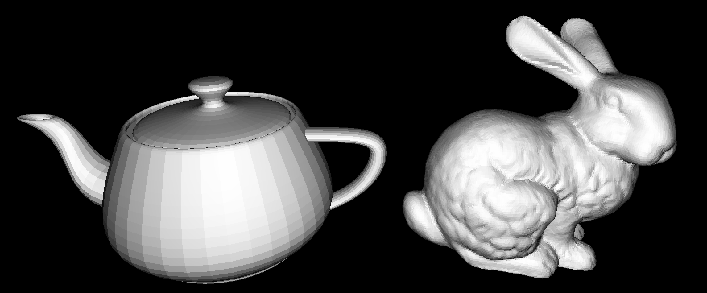

# Overview
This path tracer is a hobby project used to experiment with the math used by commercial path tracers. I didn't want this project to be complex or hard to implement, so the entire thing is written in plain Java with minimal imports. However, that doesn't mean it's slow!

# What it can do
This path tracer runs on the CPU and can take advantage of multi threading to accelerate render time. All of the meshes have bounding volume hierarchies to further decrease render time. So far, this path tracer can render `.obj` files, but I may add support for more file types in the future.

This path tracer supports any resolution, and can display the image as it's rendering.

# Run it yourself
This project is light-weight so running it yourself is easy. The entire thing is compiled and run through a small batch script. Using batch does limit users to Windows, but that's the price we pay for ease of use.

 - Install JDK on Windows
 - Clone this repository
 - Edit the `run.bat` file to change the render and directory settings

For example, if I would like to render the image in 1080p with a real-time display I would set the rendering settings to the following:

```
1920 1080 -v
```


