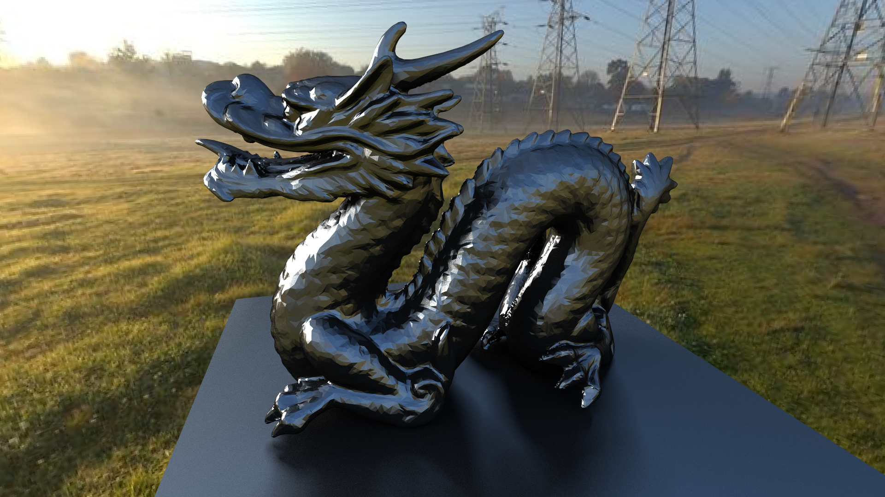

# Overview
This path tracer is a project used to experiment with the math used by commercial path tracers. I wanted this project to be easy to understand, so it is written in plain Java with minimal imports. 

# Features
**`Multithreading`**: The renderer can use any number of CPU cores to dramatically decrease the render time.

**`Bounding Volume Hierarchies`**: Upon loading a 3D object into the engine, it will algorithmically subdivide it's mesh so the object can be rendered efficiently.

**`Global Illumination`**: *WIP* Global illumination makes each object to act as a light source and allows for incredibly realistic lighting.

**`Real-time Display`**: You can watch your image render as the engine works on it in addition to the `.png` output.

# Run it yourself 
This project is light-weight so running it yourself is easy. The entire thing is compiled and run through a small batch script. Using batch does limit users to Windows, but that's the price we pay for ease of use.

 - Install JDK on Windows
 - Clone this repository
 - Edit the `run.bat` file to change the render and directory settings

The render setting are specified by the `args` variable. For example, if I would like to render the image in 1080p with a real-time display I would have the following:

```bat
:: run.bat
SET args=1920 1080 -v
```

The first two numbers specify the resolution, and `-v` tells the path-tracer to create the realtime display.

The full list of rendering setting are as follows:

| flag | desc |
|---|---|
| **-m int** | Enable multithreading and set pixel dimensions of the chunks |
| **-a int** | Set the sub-pixel sampling (antialiasing) resolution. For example, Supplying an argument of `2` will sample the pixel `2*2=4` times in a grid-like fashion. |
| **-o** | Enable `.png` file output on completion |
| **-d** | Enable realtime image display |
| **-v** | Verbose console output |

Make sure to also create the directories in `run.bat`.

```bat
:: run.bat
:: Set the location for the *.class files
SET bin=bin

:: The dir containing the *.java files
SET src=src
```
The last step is providing your own `.obj` files and configuring `src/path-tracer.java` to load them. 

No `.obj`s on hand? No problem. Here are the standard free ones:

 - [Stanford Bunny](https://graphics.stanford.edu/~mdfisher/Data/Meshes/bunny.obj)
 - [Utah Teapot](https://graphics.stanford.edu/courses/cs148-10-summer/as3/code/as3/teapot.obj)

You can easily configure `src/path-tracer.java` to load your object files by doing something like this:

```java
//src/path-tracer.java
public static void main(String[] args) {

    /* parser code ... */

    scene.meshes.add(OBJReader.read("obj/teapot.obj"));
    scene.meshes.add(OBJReader.read("obj/bunny.obj"));

    /* rendering code ... */

}
```


